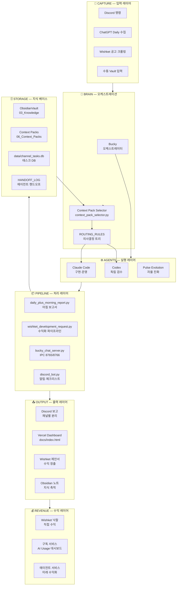
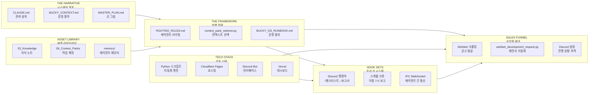
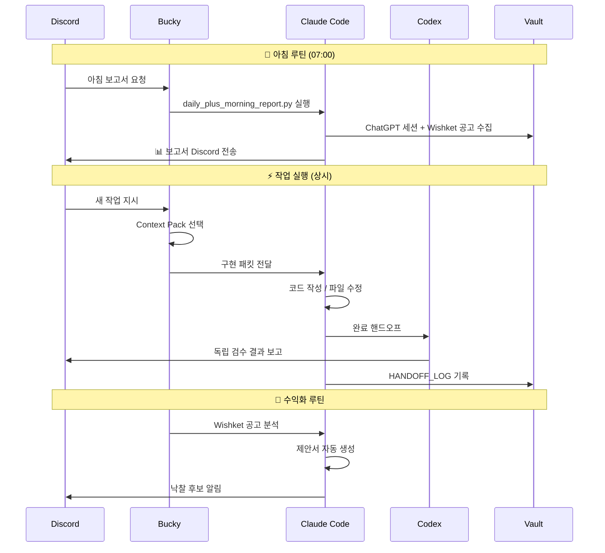
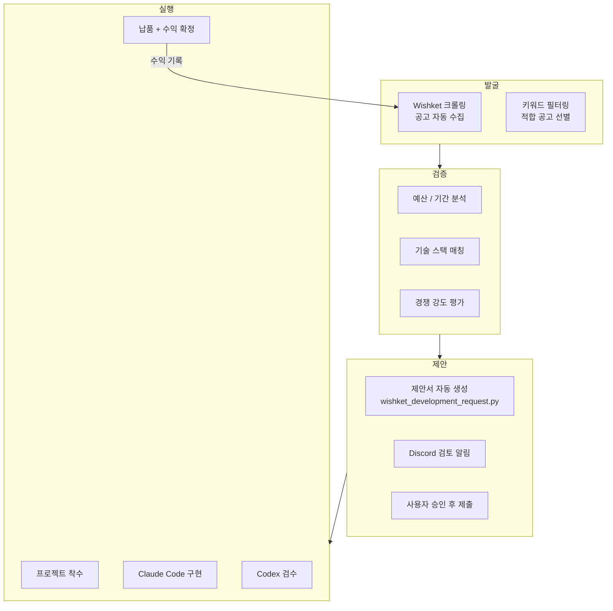
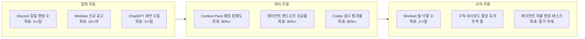

# JH Agent Brain System — Single Page Workflow

> mr.notion의 "entire business laid out on a single page" 컨셉을 JH 에이전트 OS에 적용한 워크플로우 시각화.
> 원본 영상: Sales Blueprint / Customer / Narrative / Framework / Capture / Tech Stack / Asset Library 구조 참고.

---

## 1. 전체 시스템 조감도 (Single Page OS)

---

## 2. 에이전트 역할 분리 (Department View)

---

## 3. 일일 운영 플로우 (Daily Operations)

---

## 4. 수익화 파이프라인 (Sales Blueprint 대응)

---

## 5. mr.notion 구조 ↔ JH Brain System 매핑

| mr.notion 모듈 | JH Brain System 대응 | 파일/스크립트 |
|---|---|---|
| **The Narrative** | 시스템 철학·원칙 | `CLAUDE.md`, `BUCKY_CONTEXT.md` |
| **The Framework** | 라우팅·의사결정 | `ROUTING_RULES.md`, `context_pack_selector.py` |
| **Sales Blueprint** | Wishket 수익화 | `wishket_development_request.py` |
| **Customer Finance** | 예산·수익 추적 | `data/channel_tasks.db`, AI Usage 대시보드 |
| **Sales Funnel** | 공고 → 제안 → 낙찰 | `scripts/wishket_*.py` |
| **Hook Sets** | 트리거·자동화 | Discord 명령어, 크론 스케줄 |
| **Tech Stack** | 운영 인프라 | Python, Cloudflare, Discord Bot, Vercel |
| **Asset Library** | 지식 베이스 | `03_Knowledge/`, `06_Context_Packs/` |
| **Global Sharables** | 공유 보고서 | `docs/`, Discord 채널 보고 |
| **Departments** | 에이전트 역할 | Bucky / Claude / Codex |

---

## 6. 시스템 건강 지표 (KPI Dashboard)

---

## 참고

- **원본 영상**: [@mr.notion](https://www.tiktok.com/@mr.notion/video/7635006262492613896) — Business Blueprint (Single Page Business OS)
- **핵심 인사이트**: "한 페이지에 전체 비즈니스" 컨셉 → JH는 `BUCKY_STATUS.md` 한 파일이 시스템 전체 상태를 반영
- **다음 적용 가능 개선**: 
  - [ ] Wishket 수익 추적 대시보드 추가
  - [ ] 에이전트별 KPI 자동 집계 스크립트
  - [ ] "Single Page OS" 스타일 Obsidian Canvas 파일 생성

## 관련 허브

- [[jh-system]] — JH 브레인 시스템 구조
- [[vault-galaxy-graph-bridge]] — Vault 전체 지식 허브
- [[bucky-evolution-pipeline]] — 워크플로우 파이프라인
