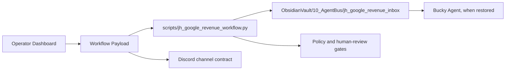

# JH-구글자동화수익대시보드 Architecture

## Current MVP



The first implementation follows this repository's existing static dashboard plus Python workflow pattern. It does not require new network installs and can be previewed through the local `docs/` surface.

## Runtime Contracts

| Contract | Location | Purpose |
|---|---|---|
| Dashboard UI | `docs/jh-google-revenue-dashboard.html` | Operator surface for phases, agents, content queue, and payload generation |
| Data seed | `data/jh_google_revenue_dashboard.json` | Project phases, agent roster, queue, KPI, and safety policy |
| Workflow helper | `scripts/jh_google_revenue_workflow.py` | Normalize requests, redact secrets, split actions, queue AgentBus notes |
| AgentBus inbox | `ObsidianVault/10_AgentBus/jh_google_revenue_inbox/` | Bucky-managed request handoff path |
| Tests | `tests/test_jh_google_revenue_workflow.py` | Safety and workflow contract verification |

## Agent Model

| Agent | Responsibility | Gate |
|---|---|---|
| KeywordScout | Keyword scoring and search-intent prioritization | immediate |
| ContentDraft | Outline, article draft, Blogger draft packet | human review |
| PolicyGuard | AdSense, spam, invalid-traffic, AI-content checks | immediate |
| HumanReview | Publication approval and review notes | required |
| RevenueAnalyst | RPM, pageview, lead, and content KPI analysis | immediate |
| MakeBridge | Make.com webhook packet and external send bridge | approval |
| DiscordOps | Discord channel/status operation | approval |

## Next.js/SQLite/Prisma Phase

When the static MVP contract is stable, move the same contracts into a separate app:

```text
apps/jh-google-automation-revenue-dashboard/
  app/
  src/lib/agents.ts
  src/lib/policy.ts
  prisma/schema.prisma
  package.json
```

Suggested stack:

- Next.js App Router
- TypeScript
- Tailwind CSS
- SQLite
- Prisma
- Local API routes for queue, review, metrics, and Make.com payload preparation

Do not add live AdSense, Search Console, Blogger, Discord, or Make.com credentials until the user explicitly provides an environment-variable plan.

## Safety Boundary

Forbidden requests are not executed, not queued as normal work, and not converted into automation. They are recorded only as `execution_mode: blocked` so the operator can see that the system refused the action.
